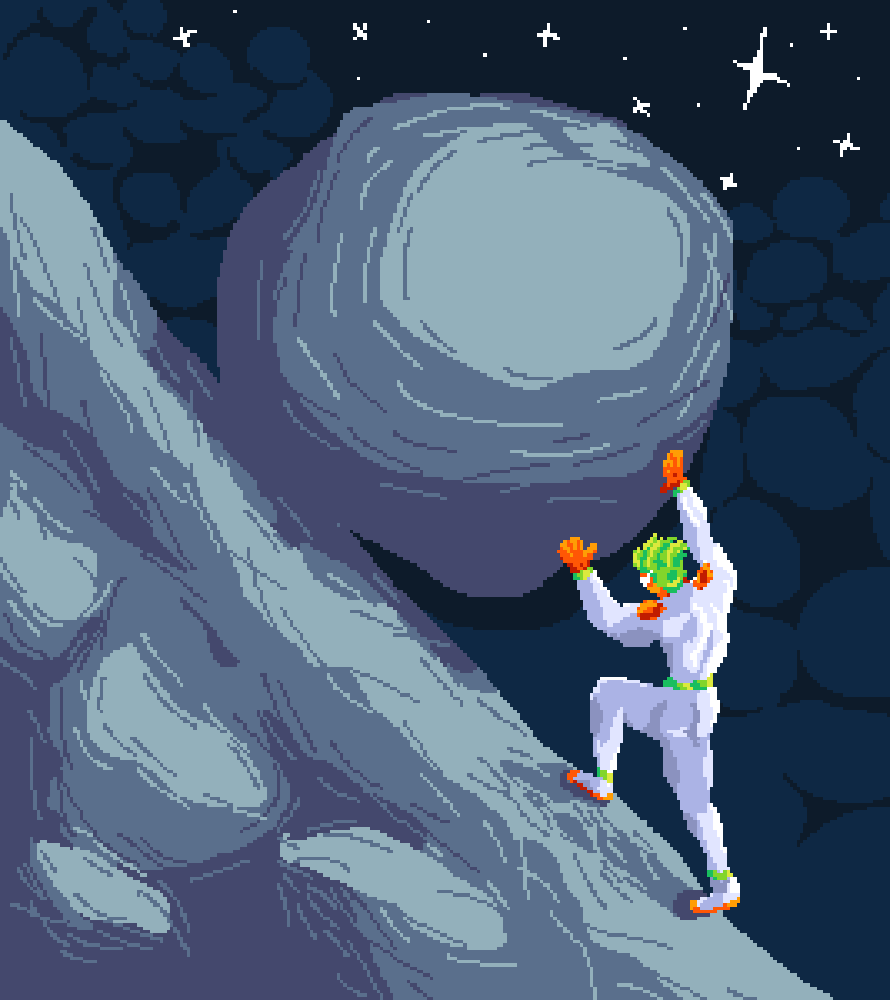

Game developer · Software engineer · Designer

I build games, tools and systems — from gameplay mechanics
to multiplayer infrastructure and custom Minecraft servers.

## Currently building

- Argalos — a custom Minecraft server with its own gameplay systems
- A self-hosted messenger built from scratch
- Game development projects in Unity and Unreal Engine
- Custom tools and plugins for game development

## STACK

**Languages**

C++ · Kotlin · C# · Elixir

**Game Development**

Unity · Unreal Engine

**Minecraft**

Paper · Kotlin · ItemsAdder · ProtocolLib

**Data**

PostgreSQL

## What I'm interested in

Game systems · Multiplayer · Backend architecture · Tools ·
Procedural generation · UI/UX

---

Currently studying Software Engineering.
